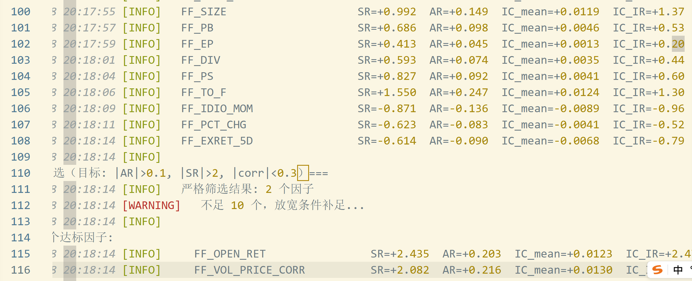
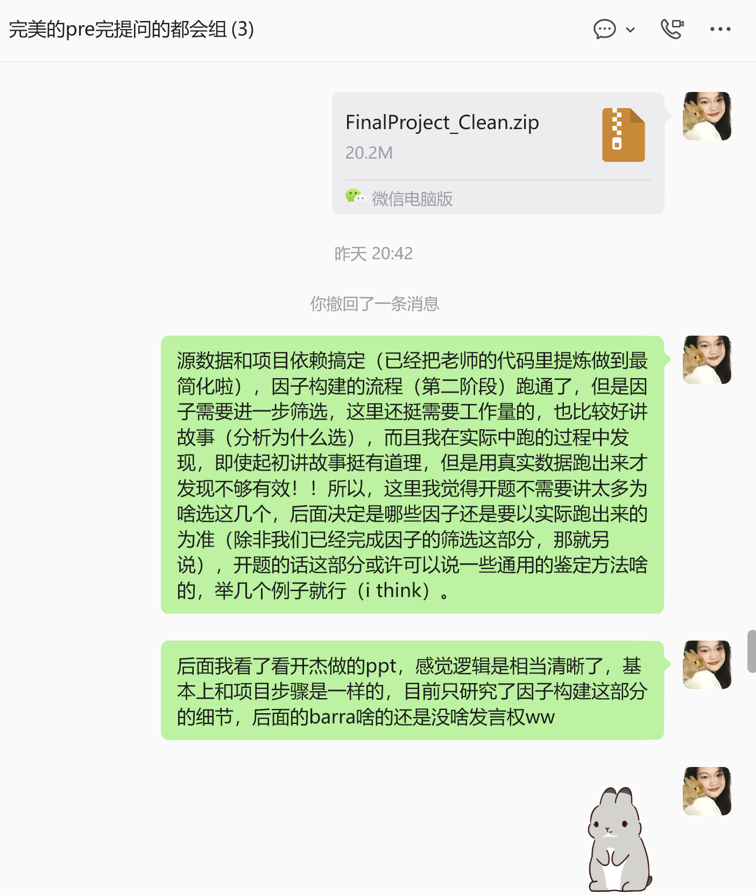

# 研究过程

### 6.4

开杰：基本流程整理

### 6.8

开杰：开题ppt的流程梳理、初稿制作

晨光：

（1）项目需求拆解，结合生成需求文档。Final Project\group_1\README.md

（2）项目开发：

① 项目依赖

数据获取问题的debug修复（兼容性问题）：虚拟空间确定项目依赖树，梳理requirements.txt

因子开发：自定义算子注入命名空间

代码规范：日志记录注入流程

② 全流程pipeline

利用agent生成模板，人工详细检查并修正了算子、因子开发的代码，跑通。

③ 算子开发：

基于Deepseek V4 Pro的建议生成共14个，且要求文献参考。

④ 因子开发

设定

SD       ='2017-01-01'       # 数据起始日

SD_PER   ='2017-12-31'       # 业绩评价起始日（避免前视偏差）

生成45个待输入因子。筛选后获得2个。

结论：需要重新梳理待输入因子。

进展同步组员。

### 6.9

因子开发的优化

基于6.8的不理想结果，对待输入因子进行进一步优化。
